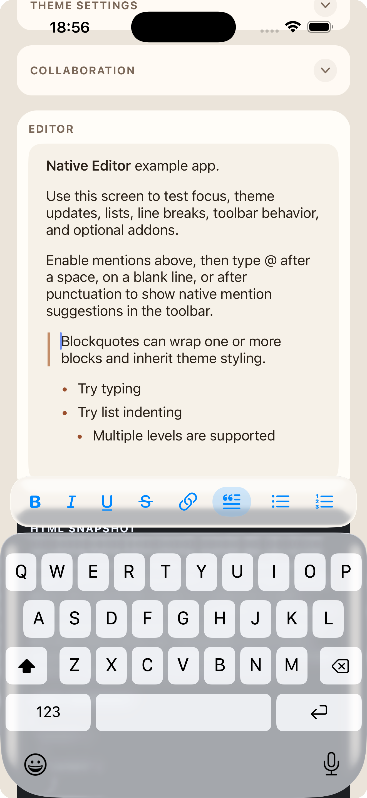
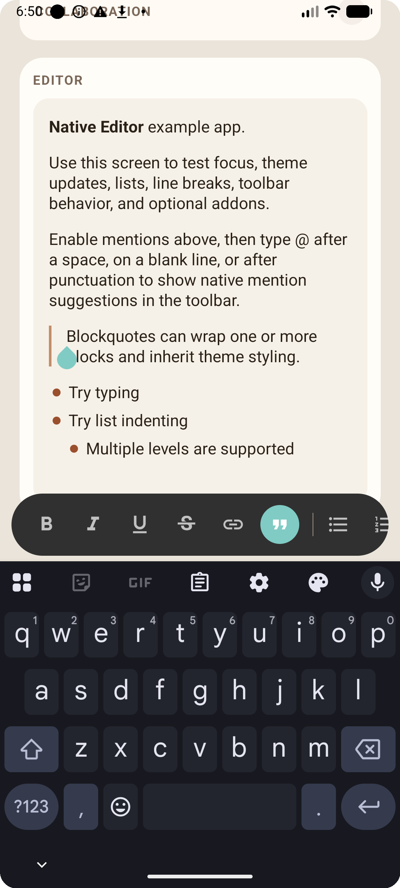

[Back to docs index](../README.md)

# `EditorTheme`

## Theme Structure

```ts
interface EditorTheme {
  text?: EditorTextStyle;
  paragraph?: EditorTextStyle;
  headings?: EditorHeadingTheme;
  blockquote?: EditorBlockquoteTheme;
  list?: EditorListTheme;
  horizontalRule?: EditorHorizontalRuleTheme;
  mentions?: EditorMentionTheme;
  toolbar?: EditorToolbarTheme;
  backgroundColor?: string;
  borderRadius?: number;
  contentInsets?: EditorContentInsets;
}
```

| Field | Type | Description |
| --- | --- | --- |
| `text` | `EditorTextStyle` | Base text styling applied across the editor. |
| `paragraph` | `EditorTextStyle` | Paragraph-specific overrides layered on top of `text`. |
| `headings` | `EditorHeadingTheme` | Optional `h1` through `h6` styling. Only applies if your schema includes heading nodes. |
| `blockquote` | `EditorBlockquoteTheme` | Blockquote indentation, quote bar, and text styling. |
| `list` | `EditorListTheme` | List indent, spacing, and marker styling. |
| `horizontalRule` | `EditorHorizontalRuleTheme` | Horizontal rule appearance. |
| `mentions` | `EditorMentionTheme` | Mention inline chip and native suggestion styling. |
| `toolbar` | `EditorToolbarTheme` | Toolbar chrome and button styling. |
| `backgroundColor` | `string` | Editor background color. |
| `borderRadius` | `number` | Editor background corner radius. |
| `contentInsets` | `EditorContentInsets` | Internal editor padding. |

## Default Behavior

All theme fields are optional. When omitted:

- `text`, `paragraph`, `headings`, `blockquote`, `list`, `horizontalRule`, and `mentions` use platform-native defaults.
- `toolbar` uses the built-in fallback values listed below.
- `backgroundColor`, `borderRadius`, and `contentInsets` are not overridden.

## `EditorContentInsets`

```ts
interface EditorContentInsets {
  top?: number;
  right?: number;
  bottom?: number;
  left?: number;
}
```

| Field | Type | Description |
| --- | --- | --- |
| `top` | `number` | Top inset inside the editor content area. |
| `right` | `number` | Right inset inside the editor content area. |
| `bottom` | `number` | Bottom inset inside the editor content area. |
| `left` | `number` | Left inset inside the editor content area. |

## `EditorTextStyle`

```ts
interface EditorTextStyle {
  fontFamily?: string;
  fontSize?: number;
  fontWeight?: EditorFontWeight;
  fontStyle?: EditorFontStyle;
  color?: string;
  lineHeight?: number;
  spacingAfter?: number;
}
```

| Field | Type | Description |
| --- | --- | --- |
| `fontFamily` | `string` | Font family name. |
| `fontSize` | `number` | Font size in points. |
| `fontWeight` | `EditorFontWeight` | Font weight token. |
| `fontStyle` | `EditorFontStyle` | `'normal'` or `'italic'`. |
| `color` | `string` | Text color. |
| `lineHeight` | `number` | Line height in points. |
| `spacingAfter` | `number` | Space below the block in points. |

## `EditorHeadingTheme`

```ts
interface EditorHeadingTheme {
  h1?: EditorTextStyle;
  h2?: EditorTextStyle;
  h3?: EditorTextStyle;
  h4?: EditorTextStyle;
  h5?: EditorTextStyle;
  h6?: EditorTextStyle;
}
```

Each slot accepts the same `EditorTextStyle` fields. Heading styles only apply if your schema emits the corresponding heading node type.

Heading styles layer on top of `text`, not `paragraph`, so you can keep body copy and headings independent:

```ts
const theme: EditorTheme = {
  text: { color: '#22303c', fontSize: 16 },
  headings: {
    h1: { fontSize: 32, fontWeight: '700', spacingAfter: 14 },
    h2: { fontSize: 28, fontWeight: '700', spacingAfter: 12 },
    h3: { fontSize: 24, fontWeight: '600' },
    h4: { fontSize: 20, fontWeight: '600' },
    h5: { fontSize: 18, fontWeight: '600' },
    h6: { fontSize: 16, fontWeight: '600', color: '#4a5b6c' },
  },
};
```

## `EditorBlockquoteTheme`

```ts
interface EditorBlockquoteTheme {
  text?: EditorTextStyle;
  indent?: number;
  borderColor?: string;
  borderWidth?: number;
  markerGap?: number;
}
```

| Field | Type | Description |
| --- | --- | --- |
| `text` | `EditorTextStyle` | Text overrides applied inside blockquotes. |
| `indent` | `number` | Total horizontal inset reserved for each blockquote depth. |
| `borderColor` | `string` | Quote bar color. |
| `borderWidth` | `number` | Quote bar width. |
| `markerGap` | `number` | Gap between the quote bar and the text. |

## `EditorListTheme`

```ts
interface EditorListTheme {
  indent?: number;
  itemSpacing?: number;
  markerColor?: string;
  markerScale?: number;
}
```

| Field | Type | Description |
| --- | --- | --- |
| `indent` | `number` | Horizontal indent per list nesting level. |
| `itemSpacing` | `number` | Vertical spacing between list items. |
| `markerColor` | `string` | Bullet or number color. |
| `markerScale` | `number` | Marker size multiplier relative to the text size. |

## `EditorHorizontalRuleTheme`

```ts
interface EditorHorizontalRuleTheme {
  color?: string;
  thickness?: number;
  verticalMargin?: number;
}
```

| Field | Type | Description |
| --- | --- | --- |
| `color` | `string` | Rule color. |
| `thickness` | `number` | Rule thickness in points. |
| `verticalMargin` | `number` | Vertical spacing above and below the rule. |

## `EditorMentionTheme`

```ts
interface EditorMentionTheme {
  textColor?: string;
  backgroundColor?: string;
  borderColor?: string;
  borderWidth?: number;
  borderRadius?: number;
  fontWeight?: EditorFontWeight;
  popoverBackgroundColor?: string;
  popoverBorderColor?: string;
  popoverBorderWidth?: number;
  popoverBorderRadius?: number;
  popoverShadowColor?: string;
  optionTextColor?: string;
  optionSecondaryTextColor?: string;
  optionHighlightedBackgroundColor?: string;
  optionHighlightedTextColor?: string;
}
```

| Field | Type | Description |
| --- | --- | --- |
| `textColor` | `string` | Inline mention chip text color. |
| `backgroundColor` | `string` | Inline mention chip background. |
| `borderColor` | `string` | Inline mention chip border color. |
| `borderWidth` | `number` | Inline mention chip border width. |
| `borderRadius` | `number` | Inline mention chip corner radius. |
| `fontWeight` | `EditorFontWeight` | Inline mention chip font weight. |
| `popoverBackgroundColor` | `string` | Legacy suggestion-surface background token. |
| `popoverBorderColor` | `string` | Legacy suggestion-surface border color token. |
| `popoverBorderWidth` | `number` | Legacy suggestion-surface border width token. |
| `popoverBorderRadius` | `number` | Legacy suggestion-surface corner radius token. |
| `popoverShadowColor` | `string` | Legacy suggestion-surface shadow token. |
| `optionTextColor` | `string` | Suggestion option primary text color. |
| `optionSecondaryTextColor` | `string` | Suggestion option secondary text color. |
| `optionHighlightedBackgroundColor` | `string` | Highlighted suggestion option background. |
| `optionHighlightedTextColor` | `string` | Highlighted suggestion option text color. |

## `EditorToolbarTheme`

```ts
type EditorToolbarAppearance = 'custom' | 'native';

interface EditorToolbarTheme {
  appearance?: EditorToolbarAppearance;
  backgroundColor?: string;
  borderColor?: string;
  borderWidth?: number;
  borderRadius?: number;
  keyboardOffset?: number;
  horizontalInset?: number;
  separatorColor?: string;
  buttonColor?: string;
  buttonActiveColor?: string;
  buttonDisabledColor?: string;
  buttonActiveBackgroundColor?: string;
  buttonBorderRadius?: number;
}
```

| Field | Type | Description |
| --- | --- | --- |
| `appearance` | `'custom' \| 'native'` | Toolbar chrome mode. `native` uses platform-native keyboard toolbar styling; visual color and radius tokens are ignored there except for layout tokens like `keyboardOffset` and `horizontalInset`. |
| `backgroundColor` | `string` | Toolbar background color. |
| `borderColor` | `string` | Toolbar border color. |
| `borderWidth` | `number` | Toolbar border width. |
| `borderRadius` | `number` | Toolbar outer corner radius. |
| `keyboardOffset` | `number` | Gap between toolbar and keyboard top edge. |
| `horizontalInset` | `number` | Horizontal screen inset for the toolbar. |
| `separatorColor` | `string` | Separator color between toolbar groups. |
| `buttonColor` | `string` | Default button icon color. |
| `buttonActiveColor` | `string` | Active button icon color. |
| `buttonDisabledColor` | `string` | Disabled button icon color. |
| `buttonActiveBackgroundColor` | `string` | Active button background highlight color. |
| `buttonBorderRadius` | `number` | Individual button corner radius. |

## Toolbar Fallback Defaults

With `appearance: 'custom'`, omitted toolbar tokens use these defaults:

| Field | Default |
| --- | --- |
| `appearance` | `'custom'` |
| `backgroundColor` | `#FFFFFF` |
| `borderColor` | `#E5E5EA` |
| `borderWidth` | `hairlineWidth` |
| `borderRadius` | `0` |
| `keyboardOffset` | `0` |
| `horizontalInset` | `0` |
| `separatorColor` | `#E5E5EA` |
| `buttonColor` | `#666666` |
| `buttonActiveColor` | `#007AFF` |
| `buttonDisabledColor` | `#C7C7CC` |
| `buttonActiveBackgroundColor` | `rgba(0, 122, 255, 0.12)` |
| `buttonBorderRadius` | `6` |

With `appearance: 'native'`, the keyboard-hosted toolbar keeps the platform-native placement defaults of `keyboardOffset: 6` and `horizontalInset: 10`, but the visual treatment comes from each platform's native chrome. On Android that now maps to a Material 3 docked-toolbar style with a 64dp container, surface-container background, borderless icon buttons, and no shadow.

| iOS | Android |
| --- | --- |
|  |  |

On iOS 26+, the native keyboard toolbar uses Liquid Glass APIs. If the host app opts into compatibility mode with `UIDesignRequiresCompatibility`, UIKit will keep the older appearance instead of the new glass styling.

## Font Tokens

```ts
type EditorFontStyle = 'normal' | 'italic';

type EditorFontWeight =
  | 'normal'
  | 'bold'
  | '100' | '200' | '300' | '400' | '500'
  | '600' | '700' | '800' | '900';
```

## Related Docs

- [Styling Guide](../guides/styling.md)
- [Mentions Guide](../modules/mentions.md)
